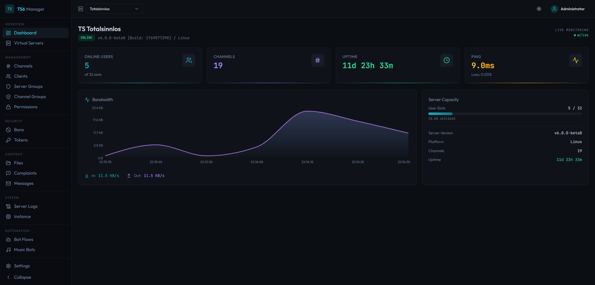
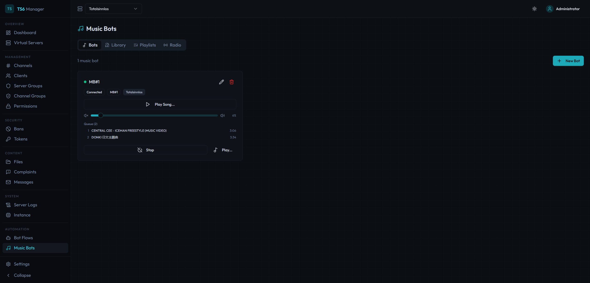
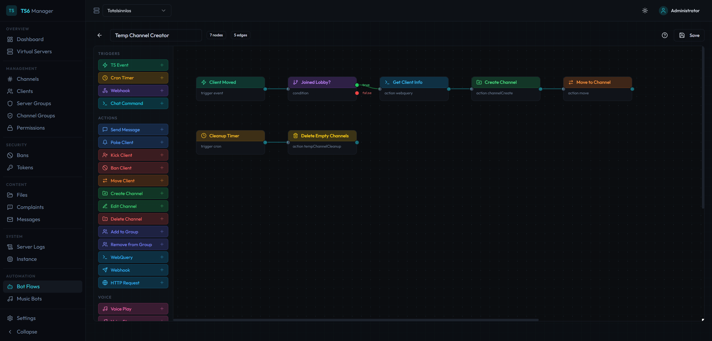
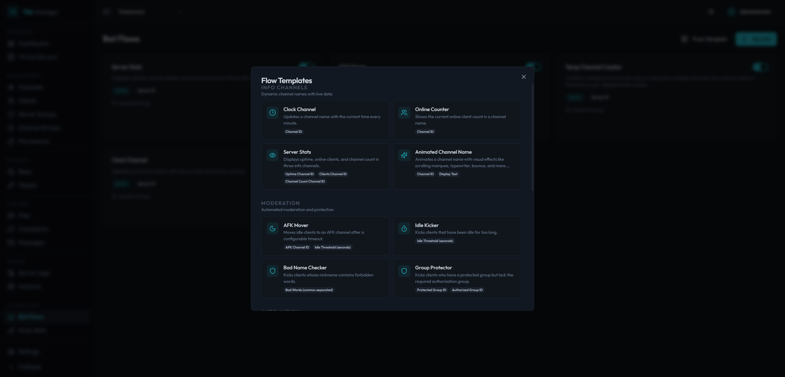

# ts6-manager

Web-based management interface for TeamSpeak servers. Control virtual servers, channels, clients, permissions, music bots, automated workflows, and embeddable server widgets — all from your browser.

Built on the **WebQuery HTTP API** (the ServerQuery replacement in modern TeamSpeak builds). Telnet is not used or supported.

> **Two ways to run:**
> - **Docker Compose** — self-hosted, full control, no panel required (see Quick Start below)
> - **Pterodactyl** — managed hosting via panel ([ts6-manager-ptero](../ts6-manager-ptero))

> Based on [clusterzx/ts6-manager](https://github.com/clusterzx/ts6-manager) with stability and compatibility improvements — see [Changes from upstream](#changes-from-upstream) below.


## Screenshots

### Dashboard
Live overview of your server: online users, channel count, uptime, ping, bandwidth graph, and server capacity at a glance.



### Music Bots
Run multiple music bots per server. Each bot has its own queue, volume control, and playback state. Supports radio streams, YouTube, and a local music library. Users in the bot's channel can control it via text commands (`!radio`, `!play`, `!vol`, etc.).



### Bot Flow Engine
Visual node-based editor for building automated server workflows. Drag triggers, conditions, and actions onto the canvas, connect them, and deploy. Supports TS3 events, cron schedules, webhooks, and chat commands as triggers.



### Flow Templates
Get started quickly with pre-built flow templates. Covers common use cases like temporary channel creation, AFK movers, idle kickers, online counters, and group protection. One click to import, then customize to your needs.



## Features

### Server Management
- Dashboard with live server stats, bandwidth graph, and capacity overview
- Virtual server list with start/stop controls
- Channel tree with drag-and-drop ordering
- Client list with kick, ban, move, poke actions
- Server & channel group management
- Permission editor (server, channel, client, group-level)
- Ban list management
- Token / privilege key management
- Complaint viewer
- Offline message system
- Server log viewer with filtering
- Channel file browser with upload/download
- Instance-level settings

### Music Bots
- Multiple bots per server, each with independent queue and playback
- Radio station streaming with ICY metadata and live title updates
- YouTube playback via yt-dlp (search, download, queue)
- Music library management (upload, organize, playlists)
- Volume control, pause, skip, previous, shuffle, repeat
- Stereo audio support with stable 20ms pacing
- Auto-reconnect with exponential backoff on disconnect
- In-channel text commands for hands-free control
- Music request history tracking

### Video Streaming
- Live video streaming from YouTube, Twitch, or direct URLs to TeamSpeak channels
- WebRTC-based with Go sidecar relay (Pion) for low-latency delivery
- Quality presets (480p, 720p, 1080p)
- In-browser preview with WebRTC playback
- A/V synchronization via RTCP Sender Reports
- Runs as a Docker sidecar container alongside the backend

### Bot Flow Engine
- Visual flow editor with drag-and-drop node canvas
- Triggers: TS3 events, cron schedules, webhooks (with mandatory secrets), chat commands (global or channel-specific)
- Actions: kick, ban, move, message, poke, channel create/edit/delete, HTTP requests, WebQuery commands
- Conditions, variables, delays, loops, logging
- Animated channel names (rotating text on a timer)
- Placeholder system with filters and expressions
- Pre-built templates for common automation tasks

### Server Widgets
- Embeddable server status banner for websites and forums
- Token-based public access (no authentication required)
- Available as live page, SVG, or PNG image
- Dark and light themes
- Configurable: show/hide channel tree and client list

### Security
- Setup wizard for initial admin account (no default credentials)
- AES-256-GCM encryption for stored credentials (API keys, SSH passwords)
- SSRF protection on all outbound HTTP requests and FFmpeg URLs
- Rate limiting on authentication endpoints
- JWT access + refresh token rotation with reuse detection
- Role-based access control (admin / viewer)
- Per-server access control for multi-tenant setups
- WebQuery command whitelist in bot flows (blocks destructive commands)
- Authenticated WebSocket connections
- Password complexity requirements

### Settings & Administration
- yt-dlp cookie file management for accessing age-restricted or member-only YouTube content
- Upload cookies via file or paste directly in the UI
- Admin-only settings panel

## Architecture

```
┌──────────────┐     ┌──────────────┐     ┌─────────────────┐
│   Frontend   │────▶│   Backend    │────▶│  TS Server      │
│  React SPA   │     │  Express API │     │  WebQuery HTTP  │
│  nginx :80   │     │  Node :3001  │     │  SSH (events)   │
└──────────────┘     └──────┬───────┘     └─────────────────┘
                            │
                     ┌──────┴───────┐
                     │   SQLite     │
                     │   (Prisma)   │
                     └──────────────┘
                            │
                     ┌──────┴───────┐
                     │   Sidecar    │
                     │  Go/Pion     │
                     │  WebRTC :9800│
                     └──────────────┘

Public:  /widget/:token  ──▶  SVG / PNG / JSON (no auth)
```

**Four packages** in a pnpm monorepo:

| Package | Description |
|---------|-------------|
| `@ts6/common` | Shared types, constants, utilities |
| `@ts6/backend` | Express API, WebQuery client, bot engine, voice bots, widgets |
| `@ts6/frontend` | React SPA with Vite, TailwindCSS, shadcn/ui |
| `sidecar` | Go WebRTC media relay (Pion) for video streaming |

The backend proxies all TeamSpeak API calls. The frontend never has direct access to API keys or server credentials.

## Tech Stack

**Frontend:** React 18, Vite, TailwindCSS, shadcn/ui, TanStack Query + Table, React Flow, Recharts, Zustand

**Backend:** Node.js, Express, Prisma (SQLite), JWT authentication, WebQuery HTTP client, SSH event listener

**Voice/Audio:** Custom TS3 voice protocol client (UDP), Opus encoding, FFmpeg, yt-dlp

**Video Streaming:** Go sidecar with Pion WebRTC v4, RTCP Sender Reports for A/V sync

## Quick Start (Docker)

1. Download the [`docker-compose.yml`](docker-compose.yml)
2. Create a `.env` file next to it:

```env
JWT_SECRET=your-random-secret-at-least-32-characters
ENCRYPTION_KEY=another-random-secret-for-credential-encryption
```

Generate secure values:

```bash
echo "JWT_SECRET=$(openssl rand -base64 32)" >> .env
echo "ENCRYPTION_KEY=$(openssl rand -base64 32)" >> .env
```

3. Start the stack:

```bash
docker compose up -d
```

4. Open `http://localhost:3000/setup` and create your admin account
5. Log in, then add your TeamSpeak server connection under **Settings → Connections** (host, WebQuery port, API key)

> `JWT_SECRET` is **required** — the backend will refuse to start in production without it.
> `ENCRYPTION_KEY` is optional but recommended — if not set, `JWT_SECRET` is used as fallback for credential encryption.

### Building from Source

```bash
git clone https://github.com/agent-fennec/ts6-manager.git
cd ts6-manager
echo "JWT_SECRET=$(openssl rand -base64 32)" >> .env
echo "ENCRYPTION_KEY=$(openssl rand -base64 32)" >> .env
docker compose -f docker-compose.local.yml up -d --build
```

### Coolify / Reverse Proxy

Use [`docker-compose.coolify.yml`](docker-compose.coolify.yml) as a starting point. Key differences from the standard compose:

- No `ports` section — the reverse proxy handles routing
- Set the domain on the **frontend** service in Coolify (port 80)
- If your TS server runs in a separate Docker network, add it as an external network on the backend service:

```yaml
services:
  backend:
    networks:
      - ts6-network
      - ts-server-net

networks:
  ts-server-net:
    external: true
    name: your-ts-server-network-id
```

## Development

Requires: Node.js 20+, pnpm 9+

```bash
pnpm install
pnpm dev          # starts backend + frontend in parallel
```

Backend runs on `:3001`, frontend on `:5173` (Vite dev server).

### Database

Prisma with SQLite. On first run:

```bash
cd packages/backend
npx prisma migrate deploy
```

The Docker images handle migrations automatically on startup.

## Environment Variables

| Variable | Default | Description |
|----------|---------|-------------|
| `JWT_SECRET` | — | **Required.** Secret for JWT signing. Must be set in production. |
| `ENCRYPTION_KEY` | — | Optional. Dedicated key for AES-256-GCM credential encryption. Falls back to `JWT_SECRET` if not set. |
| `PORT` | `3001` | Backend port |
| `DATABASE_URL` | `file:./data/ts6webui.db` | SQLite database path |
| `JWT_ACCESS_EXPIRY` | `15m` | Access token lifetime |
| `JWT_REFRESH_EXPIRY` | `7d` | Refresh token lifetime |
| `FRONTEND_URL` | `http://localhost:3000` | CORS origin |
| `MUSIC_DIR` | `/data/music` | Directory for downloaded music files |
| `SIDECAR_URL` | — | Optional. Full URL of the WebRTC sidecar service (e.g. `http://ts6-sidecar:9800`). Set in Docker when sidecar runs as a separate container. |
| `YT_COOKIE_FILE` | — | Optional. Path to a Netscape-format cookies.txt file for yt-dlp. Can also be managed via **Settings → YouTube** in the UI. |

## Environment Variables Sidecar(VideoStreaming)

| Variable | Default | Description |
|----------|---------|-------------|
| `VIDEO_QUEUE_SIZE` | `2048` | Size of the video RTP queue |
| `AUDIO_QUEUE_SIZE` | `4096` | Size of the audio RTP queue |
| `SYNC_PLAYOUT_BUFFER_MS` | `4` | Small playout buffer used by the adaptive pacing logic |
| `SYNC_VIDEO_BIAS_MS` | `4` | Optional extra holdback for video to fine-tune sync |
| `AUDIO_DELAY_MS` | `0` | Legacy / manual audio delay option With the current pacing logic this is typically expected to stay at 0 |
| `SIDECAR_DEBUG_LOGS` | `1` | Enables verbose debug logging for high-frequency runtime details |
| `VIDEO_READ_RTP_BUFFER` | `4194304` | UDP OS-socketbuffer for video port |
| `AUDIO_READ_RTP_BUFFER` | `1048576` | UDP OS-socketbuffer for audio port |
| `VIDEO_BUFSIZE` | `1M` | FFmpeg Video Buffer |

## Music Bot Text Commands

When a music bot is connected to a channel, users in that channel can control it via chat:

| Command | Description |
|---------|-------------|
| `!radio` | List available radio stations |
| `!radio <id>` | Play a radio station |
| `!play <url>` | Play from YouTube URL |
| `!play` | Resume paused playback |
| `!stop` | Stop playback |
| `!pause` | Toggle pause/resume |
| `!skip` / `!next` | Next track in queue |
| `!prev` | Previous track |
| `!vol` | Show current volume |
| `!vol <0-100>` | Set volume |
| `!np` | Show current track |

## Requirements

- TeamSpeak server with **WebQuery HTTP** enabled (not raw/telnet)
- WebQuery API key (generated via `apikeyadd` or server admin tools)
- SSH access to the TS server (only needed for bot flow event triggers)
- `yt-dlp` and `ffmpeg` installed on the backend (included in the Docker image)


## Changes from upstream

This repo is based on [clusterzx/ts6-manager](https://github.com/clusterzx/ts6-manager) and includes substantial changes across dependencies, features, and stability.

### Dependency upgrades

All major dependencies have been brought to their latest versions:

| Package | Upstream | This repo |
|---------|----------|-----------|
| TypeScript | 5 | 6 |
| Prisma | 6 | 7 |
| React | 18 | 19 |
| Express | 4 | 5 |
| Vite | 6 | 7 |
| Tailwind CSS | 3 | 4 |
| React Router | 6 | 7 |
| Zod | 3 | 4 |
| recharts | 2 | 3 |
| node-cron | 3 | 4 |

Express 5 required a webhook route syntax fix for `path-to-regexp` v8. Tailwind 4 required updating the `tailwind-merge` integration and replacing the `outline-solid` variant.

### Prisma adapter: `better-sqlite3` → `@prisma/adapter-libsql`

`@prisma/adapter-better-sqlite3` is a native Node.js C++ binding that must be compiled for the host architecture and runtime. This was replaced with `@prisma/adapter-libsql`, a pure JavaScript/WASM implementation with no native dependencies — required for running under Bun, which does not load native Node addons.

### SQLite stability under disk pressure

`SQLITE_FULL` errors are caught at three boundaries — the bot engine execution loop, `executeAction`, and `getVariable`/`setVariable` — so unhandled exceptions no longer propagate when SQLite hits its storage limit. `journal_mode=MEMORY` is also set at startup, keeping SQLite's write-ahead journal in memory rather than on disk.

### Bot flow engine additions

**New trigger events:**
- `client_recording_started` / `client_recording_stopped` — fires when a client starts or stops recording
- `client_nickname_changed` — fires when a client changes their nickname

**New actions:**
- **Generate Token** — creates a privilege key from within a flow
- **Set Client Channel Group** — assigns a channel group to a client from within a flow

**Other improvements:**
- **Trigger event filters:** UI section in BotEditor to filter which events fire a flow based on conditions
- **AFK mover `checkMuteState`:** Option to move double-muted (mic + speakers) clients immediately rather than waiting for the AFK timer

### Flow templates

17 ready-to-use templates covering common server automation:

| Template | Description |
|----------|-------------|
| Clock Channel | Updates a channel name with the current time on a cron schedule |
| Online Counter | Shows live client count in a channel name |
| Server Stats | Displays uptime, client count, and channel count across separate channels |
| Animated Channel Name | Scrolling, typewriter, bounce, blink, wave, or alternate-case channel name animation |
| Welcome Message | Sends a private message to clients when they connect |
| Support System | Moves clients to a support channel and notifies staff on a chat command |
| Temp Channel Creator | Creates a temporary channel for a client and deletes it when they leave |
| Auto-Rank | Assigns a server group based on time spent online |
| Last-Seen Tracker | Records the last time a client was online in a channel description |
| AFK Mover | Moves idle clients to an AFK channel after inactivity |
| Idle Kicker | Kicks clients who remain in the AFK channel too long |
| Bad Name Checker | Kicks or warns clients with disallowed names |
| Group Protector | Prevents unauthorized clients from entering protected channels |
| Webhook → Server Message | Sends a server-wide message triggered by an incoming webhook |
| Webhook → Assign Group | Assigns a server group to a client via webhook |
| Webhook → Update Channel | Updates a channel name or description via webhook |
| Anti-VPN | Kicks clients connecting through known VPN/proxy ranges |

### Conditions and variable fixes

- `{{...}}` placeholder wrappers are stripped before passing values to `expr-eval`, fixing all scope-based condition comparisons
- Numeric strings in the temp scope are coerced to numbers for equality checks

### Bot and server management features

- **Configurable bot nicknames:** Query bot (`queryBotNickname`) and SSH event bot (`sshBotNickname`) nicknames are set at runtime from `TsServerConfig` and exposed in the Settings UI
- **Query Bot Channel:** Configurable channel the query bot joins on connect, with a channel picker in Settings. Defaults to the server default channel when unset
- **`ChannelSelect` component:** Replaces all channel ID text inputs in BotEditor with a searchable dropdown
- **Protected Channels:** Replaced text input with a multi-select channel picker
- **Now-playing descriptions:** Music bots update the channel description with the currently playing track
- **Create Privilege Key dialog:** Generate tokens directly from the Tokens page with server/channel group assignment
- **Save connection without re-entering API key:** The API key field is optional on edit; unchanged if left blank

### Code quality and reliability

- **Pino logger** replaces `console.log` throughout the backend, with `pino-pretty` enabled in container deployments
- **Connection pool health checks** and `autoStart` error surfacing
- **Auth middleware** converted to async/await; `JWT_SECRET` causes a fatal startup error if missing in production
- **`parseIntParam` helper** for safe integer parsing from route params
- **`identityData` excluded** from music bots list query (performance)
- **`MusicBots` component** split into focused subcomponents

### Valkey/Redis cache

Adds `valkeyGet` / `valkeySet` / `valkeyDelete` helpers with graceful degradation — cache operations are non-fatal and silently skipped when Redis is unavailable.

---

For Pterodactyl-specific packaging (Dockerfile, egg, patch scripts), see [ts6-manager-ptero](../ts6-manager-ptero).

## License

MIT
